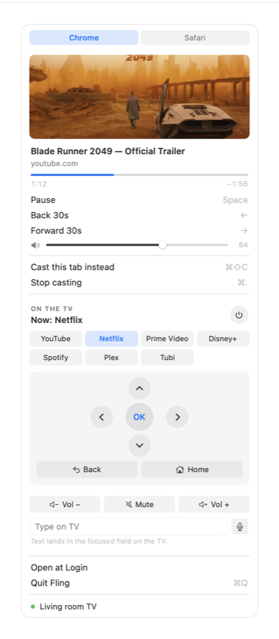

<div align="center">


# Fling

**Your TV, from the Mac menu bar.**

Cast any browser tab to a Chromecast / Google TV — and drive the TV itself:
power, apps, d-pad, volume, typing, voice search.




</div>

---

**Contents** · [Install](#install) · [Quick start](#quick-start) ·
[Casting](#casting) · [Controlling the TV](#controlling-the-tv) ·
[Troubleshooting](#troubleshooting) · [Update / uninstall](#update--uninstall) ·
[Compatibility](#compatibility) · [Privacy](#privacy) ·
[Documentation](#documentation) · [Development](#development)

## Install

Paste in Terminal:

```sh
curl -fsSLO https://raw.githubusercontent.com/damionrashford/fling/main/Scripts/get-fling.sh
bash get-fling.sh
```

Or, if you have Node or Bun installed, one command:

```sh
npx github:damionrashford/fling
```

Either way it pulls the universal binary straight from this repo, assembles
the app in /Applications, installs the Cast engine
([catt](https://github.com/skorokithakis/catt) via
[uv](https://docs.astral.sh/uv/)), and launches Fling. These downloads carry
no quarantine flag, so there is no Gatekeeper "Open Anyway" step. Re-run to
update.

**Requirements:** macOS 14+, and your Mac on the same Wi-Fi network as the TV.

## Quick start

1. **Find the icon** — Fling lives in the menu bar (top right). Click it to
   open the panel.
2. **Approve two prompts** — macOS asks permission for Fling to talk to
   Chrome and Safari. That's how it reads the address of your current tab;
   it never touches page content.
3. **Wait a moment** — the first network scan takes about ten seconds. Your
   TV's name appears in the panel footer with a green dot when found.
4. **Open a video and hit ⌘⇧C** — the tab is on the TV.

To unlock the TV controls (power, apps, d-pad, voice), do the one-time
pairing: in the panel's **On the TV** section click **Set Up TV Power…** →
the TV shows a 6-character code → type it into the panel → **Pair**.

## Casting

Open a video page in Chrome or Safari, then either press **⌘⇧C** (works
system-wide, even with the panel closed) or click **Cast this tab**.
**Cast clipboard URL** casts a link you've copied instead.

What plays: YouTube, direct media files (mp4, mkv, mp3, …), and most video
sites. Plain web pages don't — a Chromecast plays media streams, and the
panel tells you when a page isn't castable.

While casting, the panel shows artwork, title, and progress, with these
controls (active while the panel is open):

| Key | Action |
|---|---|
| ⌘⇧C | Cast the current tab (system-wide) |
| Space | Play / pause |
| ← / → | Back / forward 30 seconds |
| ⌘. | Stop casting |

**Resume where you left off** — when the page is mid-video, the cast row
becomes "Resume on TV at 12:34" and playback starts there. Fling reads the
page's actual player (and its stream, for sites yt-dlp can't crack) through a
one-time browser toggle: Chrome **View ▸ Developer ▸ Allow JavaScript from
Apple Events**, Safari **Develop ▸ Allow JavaScript from Apple Events**. The
panel shows a hint until it's on; casting works without it either way.

Both browsers installed? A Chrome/Safari picker sits at the top of the panel
so you can cast from a browser that isn't frontmost.

## Controlling the TV

Everything below lives in the panel's **On the TV** section and needs the
one-time pairing (see Quick start). Until you pair, the section offers
**Turn TV On** — a wake that works on any Chromecast by nudging the TV over
HDMI-CEC.

- **Power** — the ⏻ button sends the same power key as the TV's own remote.
  Note: many sets (TCL especially) keep their remote service awake in
  standby, so Fling can't always tell a dark screen from an on one.
- **Now playing** — the header shows which app the TV has in the foreground
  ("Now: Netflix"), and that app lights up in the launcher grid.
- **App launcher** — one click opens YouTube, Netflix, Prime Video, Disney+,
  Spotify, Plex, or Tubi on the TV.
- **D-pad** — arrows, OK, Back, Home. Navigate anything.
- **Scroll to navigate** — two-finger scroll (or mouse wheel) anywhere over
  the open panel moves through the TV's rows and grids; horizontal scrolling
  moves sideways. Flick momentum is ignored so lists don't run away.
- **Volume** — Vol−, Mute, Vol+ act instantly on the TV (the Cast page's
  slider controls the cast stream instead).
- **Type on TV** — put the TV's cursor in any text field (search, login),
  type in the panel, hit return. The text lands on the TV in one shot.
- **Voice search** — click the mic, speak, click again. Your Mac microphone
  streams to the TV's voice search — same as talking into the TV remote.
  macOS asks for microphone access the first time.

**More than one TV?** The panel footer shows the active device; a **Switch**
menu appears when several are on the network. Pairing is per-TV.

## Troubleshooting

| Symptom | Fix |
|---|---|
| "No device found" in the footer | Same Wi-Fi network? Some routers isolate wireless clients ("AP isolation") which blocks discovery — check the router setting. The scan also takes ~10 s after the panel opens. |
| "The TV did not respond" | The TV is in deep standby or unplugged. Click **Turn TV On** first, then retry. |
| Pairing code rejected | Codes expire quickly. Run **Set Up TV Power…** again and type the fresh code. |
| Remote worked before, now "Couldn't reach the TV" | A TV factory reset or OS update clears its paired remotes. Re-run **Set Up TV Power…**. |
| Typed text goes nowhere | The TV needs a text field focused on screen first — the protocol commits into the active field only. |
| Mic button does nothing | System Settings → Privacy & Security → Microphone → enable Fling. |
| Panel says "Fling needs catt" | The Cast engine is missing — rerun the install one-liner, or use the panel's **Copy install command**. |
| A normal article page won't cast | Expected — Chromecast plays media streams, not web pages. Open a video page. |
| No "Resume on TV" even mid-video | Enable the browser's Allow JavaScript from Apple Events toggle (Chrome: View ▸ Developer; Safari: Develop menu). Chrome tracks it per profile. |
| Permission prompts came back after updating | Expected with unsigned distribution — each update is a new signature to macOS. Approve once and they stay until the next update. |

Every TV-remote session writes a diagnostic log to `~/Library/Logs/Fling.log`
— when reporting a problem, the last few lines usually name the exact cause.

## Update / uninstall

**Update** — rerun the install one-liner. It replaces the app in place; your
TV pairing survives.

**Uninstall** —

```sh
rm -rf /Applications/Fling.app "$HOME/Library/Application Support/Fling"
uv tool uninstall catt
```

The Application Support folder holds the TV pairing certificate; the pairing
also has a keychain item named "Fling Android TV Remote" you can delete in
Keychain Access.

## Compatibility

| | Chromecast (all models) | Google TV / Android TV |
|---|:---:|:---:|
| Casting, playback control, wake | ✓ | ✓ |
| Power, apps, d-pad, typing, voice | — | ✓ |

The TV controls speak the Android TV Remote protocol, which classic
Chromecast dongles don't run. TVs with Google TV or Android TV built in
(TCL, Sony, Hisense, Philips, Chromecast with Google TV, …) support
everything.

## Privacy

Everything runs on your LAN. No servers, no accounts, no analytics, nothing
phones home. The mic streams to your TV only while the mic button is red.

## Documentation

| Document | What it covers |
|---|---|
| [docs/architecture.md](docs/architecture.md) | The three layers, state model, threading rules |
| [docs/remote-protocol.md](docs/remote-protocol.md) | The Android TV Remote v2 implementation: pairing, session, voice |
| [docs/casting.md](docs/casting.md) | URL classification, the in-page probe, cast planning, resume |
| [docs/development.md](docs/development.md) | Building, testing, the preview harness, the live hardware driver |
| [docs/distribution.md](docs/distribution.md) | The repo-served binary, installers, the signing model |
| [CHANGELOG.md](CHANGELOG.md) | Release history, [Keep a Changelog](https://keepachangelog.com/en/1.1.0/) format |

## Development

```
Sources/
├── Fling/       menu bar app — panel UI, status item, shortcuts, scroll remote
└── FlingKit/    state hub, casting pipeline, browser + process seams
    └── AndroidTVRemote/   dependency-free Android TV Remote v2 client
Tests/FlingKitTests/       299 hermetic tests — no TV, browser, or network
Scripts/                   bundle, installers, binary publishing
bin/Fling                  the universal binary the installers serve
```

```sh
swift build && swift test    # 299 tests
./Scripts/bundle.sh          # signed .app in build/ (identity in Scripts/signing-identity.local, else ad-hoc)
./Scripts/publish-bin.sh     # refresh bin/Fling, the binary the installer serves
```

`Fling --preview-panel` renders every panel state in one window;
`FLING_PREVIEW=hero` renders the screenshot above. The deeper story —
architecture, the protocol implementation, the hardware-in-the-loop test
driver — lives in [docs/](docs/).
